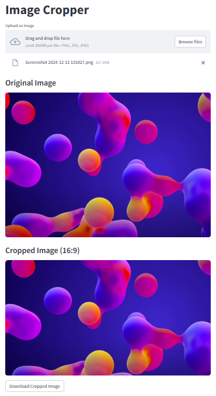

# 📸 Image Cropper Web App

This Streamlit web application allows users to upload an image and crop it to a specific aspect ratio. The aspect ratio can be chosen from a list of preset values (like 16:9, 4:3, 9:16, etc.), making it useful for content creators, designers, and photographers.

---

## 🚀 Features

- 📂 Upload image (PNG, JPG, JPEG)
- 🔧 Select from multiple predefined aspect ratios
- 🔍 Preview both original and cropped versions
- 💾 Download the cropped image instantly

---

## 🧰 Preset Aspect Ratios

### 📺 Landscape (Width > Height)
- `16:9` – Widescreen
- `21:9` – Ultrawide / CinemaScope
- `4:3` – Standard / Fullscreen
- `3:2` – Classic / DSLR
- `5:4` – Large Format
- `2:1` – Univisium / Panoramic
- `1.85:1` – Academy Widescreen
- `2.39:1` – Anamorphic Widescreen

### 📱 Portrait (Height > Width)
- `9:16` – Vertical Video
- `9:21` – Vertical Ultrawide
- `3:4` – Vertical Standard
- `2:3` – Vertical Classic
- `4:5` – Instagram Portrait
- `5:8` – Golden Ratio
- `3:5` – Film Portrait

---

## 🛠 How to Use

1. ▶️ **activate the virtual environment** `source .venv/bin/activate`
2. ▶️ **Run the app** with `streamlit run image_cropper_app.py`
3. 📤 **Upload your image** using the file uploader
4. 🧮 **Select an aspect ratio** from the sidebar dropdown
5. 👀 **View the original and cropped image** displayed vertically
6. 📥 **Click the download button** to save your cropped image

---

## 📦 Requirements

Install dependencies with:
```bash
pip install -r requirements.txt
```

---

## 🖼 Example



---

## 📃 License
MIT License

